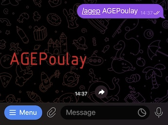
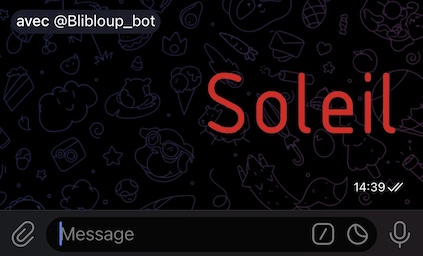

# Blibloup Bot

Blibloup_Bot is a Telegram bot hosted on Heroku that aims to provide many features such as :
- QR code generation and reading
- Sticker generation
- Pimping text
- Creating ical files

We are very open to any suggestion and contribution! See [Contributing](#contributing) section for more information.

## Usage

You can use the bot by sending a message to [@Blibloup_Bot](https://t.me/Blibloup_bot).

If you want to create you own instance of the bot and run it locally or on your own server, please see the [Installation](#installation) section.

## What does it do?

### AGEPACK sticker generation

You can generate a sticker from text.\
Either by directly interacting with the bot.



Or by using the inline mode in any group or chat

 


## Roadmap

Here is a list of features we would like to implement in the future.
- [ ] QR code generation and reading
- [ ] Sticker generation
- [ ] Pimping text
- [ ] Creating ical files

## Support

If you need help, you can contact us on Telegram at [@Roilek](https://t.me/Roilek) and [@O_l_i_v_i_e_r](https://t.me/O_l_i_v_i_e_r).

If you want to contact us regarding installation problems, please make sure you have followed the [Installation](#installation) instructions, looked over the internet for your problem, and asked enough ChatGPT about it ;)

## Installation

Please note that the following instructions assume you have python installed and have some kind of a functional development environment.

1. Go to a forlder and clone the project.
```bash
git clone git@github.com:Roilek/blibloup-bot.git
```

2. Go to the project directory and install the dependencies.
```bash
cd blibloup-bot
pip install -r requirements.txt
```

3. Create a `.env` file and fill it with the necessary variables.
```txt
# Your development environment - DEV for local (polling), PROD for remote (webhook)
ENV=DEV
# Telegram bot token
TOKEN=<your_token>
# ID of the group where the bot will log
LOG_GROUP_ID=<your_log_group_id>
# URL of your Heroku app, if you want to host (on heroku)
HEROKU_PATH=<your_heroku_app_url>
```
- To create a `TOKEN`, you must contact [@BotFather](https://t.me/BotFather) on Telegram and create your bot.
- To know your `LOG_GROUP_ID`, you must create a groupe, add the bot, and send the command `/dump`. The bot should respond with the dump of your message, including the chat id.
- Knowing your `HEROKU_PATH` is beyond the scope of this README, but you can explore heroku and find informations on this [great tutorial](https://towardsdatascience.com/how-to-deploy-a-telegram-bot-using-heroku-for-free-9436f89575d2) about hosting Telegram bots on Heroku.

Make sure to keep your `.env` file secret!

4. Run the bot.
```bash
python main.py
```

## Contributing


We are very open to any contribution! If you want to contribute, please follow the following steps:

### Have and idea?
Create an issue or send us a message over Telegram!

### Want to implement a feature?
Create a pull request!\
Please test your code before submitting it, and make sure it is well documented.

## License

This project is licensed under the GNU General Public License v3.0 - see the [LICENSE](LICENSE) file for details.
